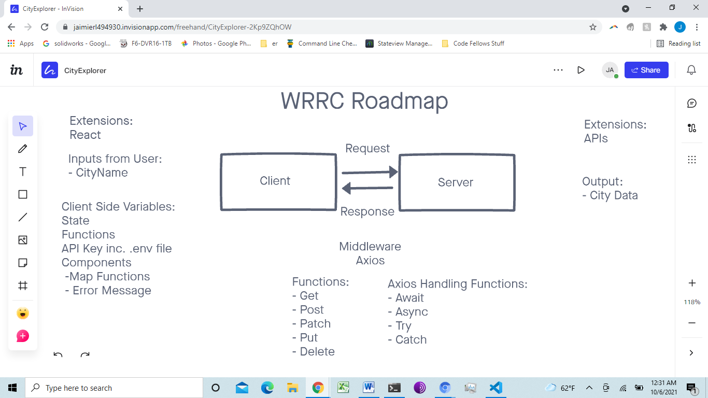

# City Explorer

**Author**: Jae Loney
**Version**: 1.0.0 

## 

## Deployed Link
https://city-explorer-jae.netlify.app/

## Overview
This app provides information to a user so they can learn more about a city they are curious about. The site will return the latitude and longitude of the city as well as a map of the city.

## Getting Started
To create this site for themselves, a user would build a react app and inport bootstrap and axios. Then they would go to LocationIQ and set up an API and Netlify/github to host the site. Then they would build out the react app to gather the user information and send it to Location IQ, and display the results including a map and an error log.

## Architecture
<!-- Provide a detailed description of the application design. What technologies (languages, libraries, etc) you're using, and any other relevant design information. -->

## Change Log
<!-- Use this area to document the iterative changes made to your application as each feature is successfully implemented. Use time stamps. Here's an example:

01-01-2001 4:59pm - Application now has a fully-functional express server, with a GET route for the location resource. -->

## Credit and Collaborations
<!-- Give credit (and a link) to other people or resources that helped you build this application. -->

Name of feature: 
Estimate of time needed to complete: 
Start time: 
Finish time: 
Actual time needed to complete: 

Name of feature: 
Estimate of time needed to complete: 
Start time: 
Finish time: 
Actual time needed to complete: 

Name of feature: 
Estimate of time needed to complete: 
Start time: 
Finish time: 
Actual time needed to complete: 

Name of feature: 
Estimate of time needed to complete: 
Start time: 
Finish time: 
Actual time needed to complete: 

Name of feature: 
Estimate of time needed to complete: 
Start time: 
Finish time: 
Actual time needed to complete: 

Name of feature: 
Estimate of time needed to complete: 
Start time: 
Finish time: 
Actual time needed to complete: 

Name of feature: 
Estimate of time needed to complete: 
Start time: 
Finish time: 
Actual time needed to complete: 